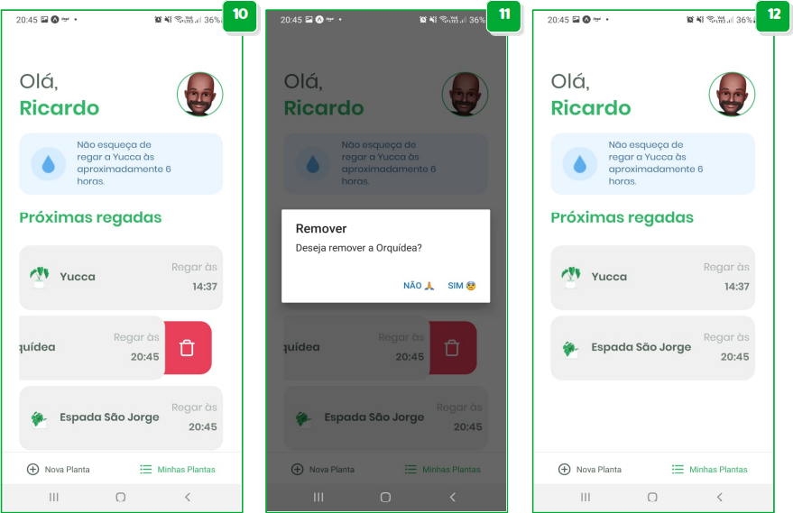

# NLW5 - Next Level Week 5 - Rocketseat - React Native - Plant Manager 1.0!

## Demonstração:

## Techs - Tecnologias envolvidas:
* [ ] React
* [ ] React-Native
* [ ] Typescript
* [ ] Expo

## Contribuições externas:
### 1) Rocketseat:
    Este protótipo só foi possível com a contribuição da Rocketseat, através da NLW4. Será bem útil para o meu portfólio.

    Para conhecer o excelente trabalho da Rocketseat, seguem links:
    * Site Oficial - https://rocketseat.com.br/
    * Youtube - Rocketseat: https://www.youtube.com/c/RocketSeat/featured
    
    Não perca tempo e dê um passo para o pŕoximo nível:

## 2) Author:
**Ricardo de Almeida**, tutoriado pelo **Rodrigo Gonçalves, da Rocketseat**.